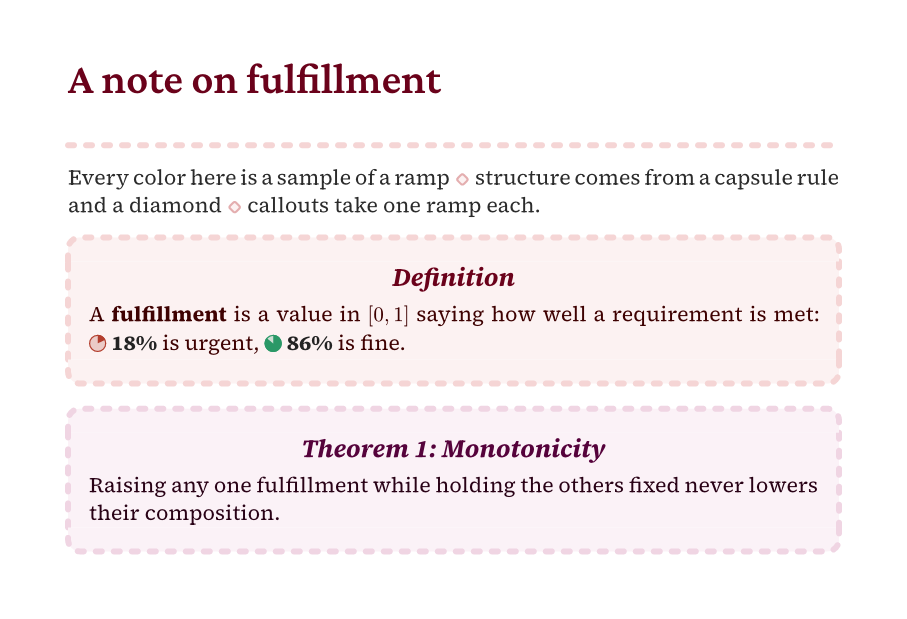
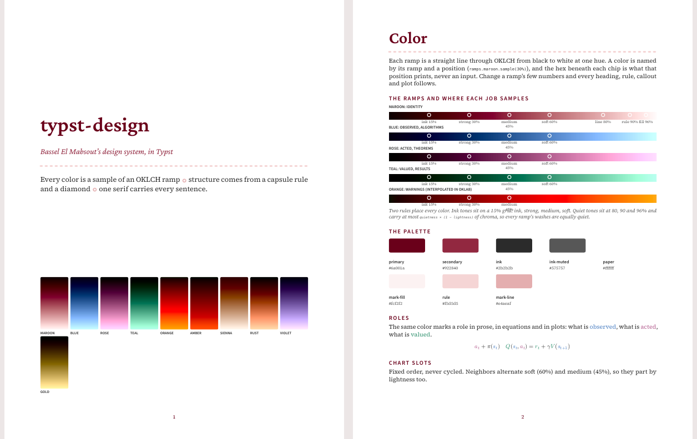
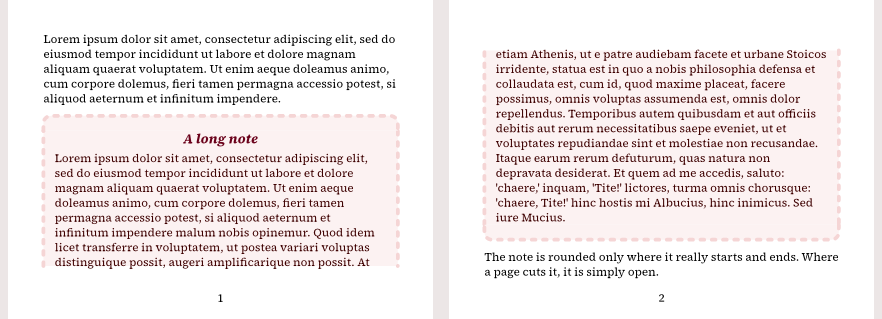
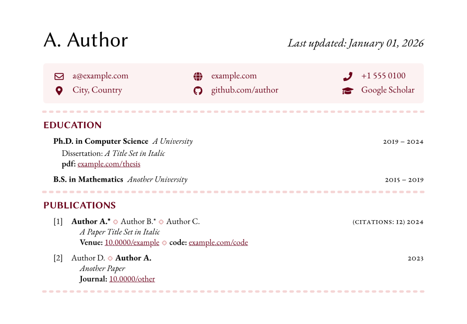

# typst-design

A design system for documents, built from a few hand-picked rules and written in Typst. It covers OKLCH color ramps, capsule rules and diamond separators, callouts that break cleanly across pages, role-colored math, fulfillment marks, and templates for theses, CVs, résumés, statements and working documents.



```typst
#import "@local/typst-design:0.1.0": *
#show: callout-rules

#note(title: [Definition])[A *fulfillment* is a value in $[0, 1]$: #price(0.18) is urgent.]
```

- **Color from gradients, not swatches.** Every color is a ramp and a position (`ramps.maroon.sample(30%)`). Change a ramp's two endpoints and every heading, rule, callout and plot follows.
- **One color in, a whole palette out.** `ramp-from(color)` grows a ramp from a single color, and three rules place every sample on it. Ink tones sit on a 15% grid. Running text stays at medium or deeper, so it keeps 4.5:1 contrast. Quiet tones carry chroma in proportion to their distance from white, so washes are equally quiet in every hue.
- **Callouts that break like prose.** A long note is rounded only where it really starts and ends. Where a page cuts it, it is simply open.
- **Templates as data.** Each template takes its whole look as one dictionary. Recolor a CV from one argument, or switch a thesis to a university's black-heading compliance mode.
- **Relative units.** Sizes are steps of one ×1.2 type scale and `em`. Nothing is in pixels.
- **No dependencies.** The CeTZ figure primitives take `cetz` as an argument, so you bring your own.

## Contents

- [Installation](#installation)
- [Color](#color)
- [Marks](#marks)
- [Callouts](#callouts)
- [Templates](#templates)
- [Fulfillment marks](#fulfillment-marks)
- [Typography](#typography)
- [API overview](#api-overview)
- [Compatibility](#compatibility)
- [Development](#development)
- [License](#license)

## Installation

The package is not on Typst Universe yet. Install it as a local package.

**Script.** This links the checkout into Typst's local package directory:

```console
$ git clone https://github.com/bmabsout/typst-design
$ typst-design/scripts/install-local.sh
```

**Nix.** The flake exposes the package path:

```nix
{
  inputs.typst-design.url = "github:bmabsout/typst-design";
  # in a shell or a derivation:
  #   TYPST_PACKAGE_PATH = typst-design.packages.${system}.default;
}
```

Then import it:

```typst
#import "@local/typst-design:0.1.0": *
```

The identity's faces are Source Serif 4, Crimson Pro and Source Sans 3. The CV family uses EB Garamond, Libertinus Sans and Font Awesome 5 Free. `nix develop` provides all of them.

## Color

A **ramp** is a straight line through OKLCH from black to near-white at one hue. Its chroma and hue may drift along the way.

```typst
#let maroon = ramp(5deg, chroma: (60%, 5%), hue-shift: 15deg)  // = ramps.maroon
```

**One color is enough.** `ramp-from(color)` grows a whole identity ramp whose strong sample (30%) is exactly that color. Lightness runs straight to white, chroma fades, and the hue warms a little, as maroon's does. Every heading, wash, rule and mark then follows from the rules below. Pick a color dark enough for headings (about 7:1 on white or more).

```typst
#let style = cv-style(ramp: rgb("#6a001a"))  // a color works wherever a ramp does
```

| Ramp | From | To | Used for |
| --- | --- | --- | --- |
| `maroon` | `oklch(0% 0.24 5°)` | `oklch(100% 0.02 20°)` | identity, headings, rules, blush |
| `sienna` | `oklch(12% 0.18 50°)` | `oklch(100% 0.02 60°)` | an alternative identity in brownish orange |
| `blue` | `oklch(0% 0.116 256°)` | `oklch(100% 0.116 256°)` | *observed*, algorithms |
| `rose` | `oklch(0% 0.124 346°)` | `oklch(100% 0.124 346°)` | *acted*, theorems |
| `teal` | `oklch(0% 0.104 166°)` | `oklch(100% 0.104 166°)` | *valued*, results |
| `orange` | `oklch(0% 0.292 43°)` | `oklch(100% 0.292 43°)`, through OKLab | warnings |
| `rust`, `violet`, `gold` | hues 43°, 300°, 89° | constant chroma | chart slots 4–6 |

Three rules decide where each job samples a ramp:

| Rule | Positions (`stops`) | Jobs (`jobs`) |
| --- | --- | --- |
| **Ink tones** sit on a 15% grid | `ink` 15%, `strong` 30%, `medium` 45%, `soft` 60% | Heading 1 and callout titles are strong. Heading 2, supplements, notices, roles and references are medium. Heading 3 and chart marks are soft. |
| **Running text** sits at medium or deeper | 15–45% | keeps 4.5:1 contrast on paper in every ramp. Soft is for large text and marks only. |
| **Quiet tones** keep a sample's lightness and hue, with chroma ≤ `quietness × (1 − L)` | `line` 80%, `rule` 90%, `fill` 97% | diamond outlines (80%), capsule rules and callout outlines (90%), panels and callout washes (97%) |

```typst
#ramps.rose.sample(stops.strong)     // a theorem's title
#quiet(ramps.rose, stops.fill)       // its wash
#tones(ramps.rose)                   // wash, line, title, supplement, ink, notice
#text(fill: roles.valued)[reward]    // teal at the medium stop
```

`palette` names the identity's colors (`primary`, `secondary`, `ink`, `ink-muted`, `mark-fill`, `rule`, `mark-line`). `chart` gives six categorical colors that alternate soft and medium, so neighbors differ in lightness as well as hue. On the dark ground `paper-dark`, `dark-stop(t)` moves a text tone so it keeps the contrast it has on white, and `quiet-dark(ramp, t)` is the matching quiet tone. Text tones keep 4.5:1 there too.



## Marks

```typst
#capsule-rule()                       // full-width, round-capped dots
#sep[Robotics][Type theory][Control]  // items joined by diamonds
#line(length: 100%, stroke: capsule(palette.rule))  // the capsule stroke anywhere
```

The **diamond** is the only inline separator: a rounded 0.4em square turned 45°, filled `mark-fill` and outlined `mark-line`. It scales with the text.

## Callouts

```typst
#show: callout-rules

#note(title: [Markov Decision Process])[A tuple $(S, A, T, R)$.]
#theorem(title: [Monotonicity])[…] <thm:mono>   // numbered, referenceable
#algorithm(title: [Balanced Policy Gradient])[…]
#notice[results were collected at 500 Hz.]
```

Each kind owns a ramp: notes maroon, theorems rose, algorithms blue, notices orange. A callout is a `figure`, so it can be labeled and referenced. `callout-rules` lets these figures break across pages.



Typst rounds and closes every fragment of a breakable block. `flow-block` carries only the side strokes and the fill, and places the two rounded caps in the flow: one above the first fragment, one after the last line.

`frame` is the other engine. The block records where it starts and ends, and `frame-rules` draws each page's piece on the page background as one shape, so a dashed outline runs on around the corners without a seam. It needs `#show: frame-rules` (pass your own page background as `background:`), and on a continued page it spans the text area from margin to margin.

```typst
#show: frame-rules
#let (note, theorem) = callouts(engine: frame)
```

Use `callouts(..)` to configure the family, for example `callouts(title-size: 14pt, theorem-ramp: ramps.teal)`. `classic: true` reproduces an earlier engine and tones exactly.

## Templates

Each template is a style dictionary, a kit of functions built from it, and a page rule.

**CV.** Pass `ramp` to recolor the whole CV:

```typst
#let style = cv-style(owner: "Author A.")  // the owner's name is bolded in author lists
#let kit = cv-kit(style)
#show: cv-page.with(style: style)

#(kit.section-list)("Education", (
  (kit.entry)((kit.entry-heading)(l: [Ph.D.], m: [A University], r: [2019 -- 2024]), [Dissertation: _…_]),
))
```



**Thesis.** This builds the front matter in roman numerals, chapters with a capsule rule and a local contents, headings that darken with rank, and references colored like their target. It includes Boston University's required pages, and `compliance: "bu"` gives the black headings its thesis office requires.

```typst
#let t = make-template(style: thesis-style(colors: thesis-colors(compliance: "bu")))
#show: (t.assemble_thesis_document).with(title_page: …, main: …)
```

**Résumé, statement, working document.** `resume-kit`, `statement` (research and teaching statements and letters, titled "Name ◆ Title") and `working-document` (notes and reports in the CV's voice).

## Fulfillment marks

A fulfillment is a value in [0, 1] saying how well a requirement is met. Low is urgent. `fulfillment` is the scale from bad to good: crimson → copper → amber → green → teal. Every sample keeps 3:1 contrast on paper, enough for marks and bold labels. The ends differ in lightness and lean blue at the good end, so readers with red–green color blindness can still tell them apart.

```typst
#price(0.42)            // a pie and "42%"
#pie(0.42, size: 1em)
#trace(values, back: 15, ahead: 15, at: datetime.today())
```

## Typography

| Face | Role |
| --- | --- |
| Source Serif 4 | every sentence, and headings at the Subhead optical size |
| Crimson Pro | names, titles, display moments (step 2 and up) |
| Source Sans 3 | short UPPERCASE labels only (`label-text`) |
| EB Garamond, Libertinus Sans | the CV family |

`scale(n)` is step *n* of one ×1.2 scale. `font-options` holds body presets matched by x-height.

## API overview

Everything is exported flat, and also by module: `colors`, `typography`, `marks`, `callout`, `frames`, `rlmath`, `icons`, `fpl`, `figures` and `templates`. Names that would shadow Typst's own (`state`, `document`) are only reachable through their module.

| Module | Exports |
| --- | --- |
| color | `ramp`, `ramp-from`, `ramps`, `stops`, `jobs`, `quiet`, `quietness`, `shade`, `tones`, `classic-tones`, `mirror`, `paper-dark`, `dark-stop`, `quiet-dark`, `roles`, `palette`, `chart`, `fulfillment`, `swatch` |
| type | `faces`, `scale`, `ratio`, `font-options`, `label-text`, `minor` |
| marks | `capsule`, `capsule-rule`, `diamond`, `sep` |
| callouts | `callouts`, `callout-rules`, `flow-block`, `frame`, `frame-rules`, `frame-layer`, `seamless-block`, `note`, `theorem`, `algorithm`, `notice` |
| math | `rlmath.state` / `action` / `reward`, `rl`, `pmean`, `fbox`, `loss`, `expect`, `policy`, `make-abbrv`, `abbreviations`, `abbreviation-table` |
| fulfillment | `fulfillment-color`, `pie`, `price`, `trace`, `percent`, `state-of` |
| figures | `figures.bell(cetz, ..)`, `figures.segment(cetz, ..)` |
| templates | `cv-style`, `cv-kit`, `cv-page`, `resume-style`, `resume-kit`, `resume-page`, `statement`, `title-line`, `thesis-colors`, `thesis-style`, `make-template`, `working-document`, `section-title`, `panel`, `dated`, `accent` |

Each function's documentation is in its source file's `///` comments.

## Compatibility

Tested on Typst 0.13.1, 0.14.2 and 0.15.1, and it works with HTML export.

## Development

```console
$ nix develop                 # typst, tinymist, the faces, the package on its path
$ nix flake check             # compiles tests/laws.typ and every example
$ nix build .#gallery         # gallery/gallery.pdf
$ python3 scripts/images.py   # the README's images in docs/images
```

Compiling `tests/laws.typ` runs every `assert` in it. It checks that the ramps are their documented gradients stop for stop, that every sample obeys the three rules, that text keeps its contrast on white and on the dark ground, that quiet tones stay quiet in every ramp, and that the fulfillment scale stays readable. Changes to the rules belong there first.

## License

[MIT](LICENSE) © Bassel El Mabsout. The design is his and was picked by hand: the ramps and where each job samples them, the capsule rule, the diamond, the callouts, the type pairing and every template's look. Use it freely and keep the notice.
