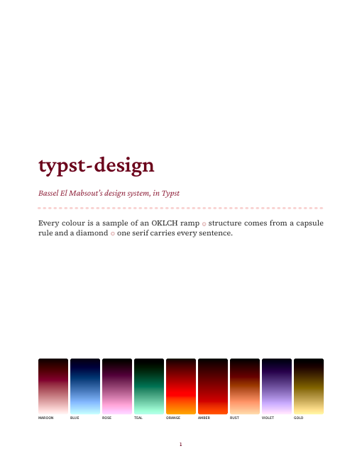
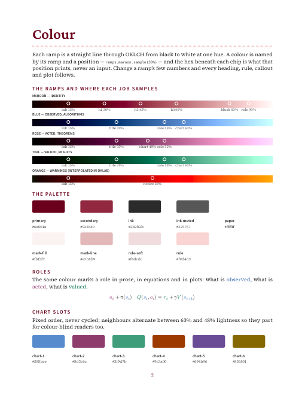

# typst-design

Bassel El Mabsout's design system for Typst: the colour ramps, marks, callouts and templates that the dissertation, the CV and its statements and Prodrome's marks were each carrying a copy of, gathered into one package.

```typst
#import "@local/typst-design:0.1.0": *
```

 

`gallery/gallery.pdf` shows every piece. `tests/laws.typ` holds the system to its definitions. It pins the ramps stop for stop to the thesis's gradients and the named samples to the hex values they print.

## Principles

1. **Every colour is a sample of a ramp.** A ramp is a straight line through OKLCH from black to white at one hue. A colour is named by its ramp and a position (`ramps.maroon.sample(30%)`), and its hex is an output, never an input. To change the identity you change a ramp's few numbers, and every heading, rule, callout and plot follows.
2. **Colour means something.** Headings darken with rank along the maroon ramp. Three role ramps mark what is *observed* (blue), *acted* (rose) and *valued* (teal), the same in prose, equations and plots.
3. **Structure from marks, not boxes.** A capsule rule divides, a diamond joins, and space does the rest.
4. **Relative units.** Sizes are steps of one ×1.2 scale (`scale(n)`), `em`, and shares of a whole. Nothing is specified in pixels. Print geometry (margins, a rule's 3pt) stays in points because paper is measured in them.

## Install

**Nix.** The flake exposes the package path:

```nix
inputs.typst-design.url = "github:bmabsout/typst-design";
# …
TYPST_PACKAGE_PATH = typst-design.packages.${system}.default;
```

`nix develop` here gives a shell with Typst, Tinymist, the faces, and the package on its path. `nix build .#gallery` renders the gallery, and `nix flake check` compiles the laws.

**Without Nix.** Run `scripts/install-local.sh`, which links this checkout into Typst's local package directory.

The faces are Source Serif 4, Source Sans 3 and Crimson Pro (the identity), plus EB Garamond, Libertinus and Font Awesome 5 (the CV family).

## What's in it

| Module (`lib.typ` name) | What | Came from |
| --- | --- | --- |
| `colors` | `ramp()`, `ramps` (maroon, blue, rose, teal, orange, amber, rust, violet, gold, black), `stops`, `shade()`, `tones()`, `mirror()`, `roles`, `palette`, `chart`, `fulfillment`, `swatch()` | thesis `style.typ`, Prodrome |
| `typography` | `faces`, `scale()`, `font-options`, `label-text()`, `minor()` | thesis `font_options`, the design system |
| `marks` | `capsule()` stroke, `capsule-rule()`, `diamond()`, `sep()` | CV and thesis `long_line` / `diamond` |
| `callout` | `seamless-block`, `callouts(..)` factory, `note`, `theorem`, `algorithm`, `notice` | thesis `style.typ` |
| `rlmath` | role-coloured `state` / `action` / `reward`, the usual symbols in `rl`, `pmean`, `fbox`, `loss`, `expect`, `policy`, `make-abbrv`, `abbreviation-table` | thesis `commands.typ` |
| `icons` | `fa`, `icon()` | CV |
| `fpl` | `colour()`, `pie()`, `price()`, `trace()`, `percent()`, `state-of()`, drawn in `fulfillment`: crimson → copper → amber → green → teal | Prodrome `typst/lib.typ` |
| `figures` | CeTZ `bell()` and `segment()`, taking the `cetz` module as an argument so the package depends on nothing | thesis `figures/mdp.typ` |
| `templates.thesis` | `thesis-colors(compliance:)`, `thesis-style()`, `make-template()` with Boston University's pages | thesis `thesis_template.typ` |
| `templates.cv` | `cv-style(ramp:)`, `cv-kit()`, `cv-page()` | `resume_typst/src/lib_cv.typ` |
| `templates.resume` | `resume-style()`, `resume-kit()`, `resume-page()` | `resume_typst/src/lib.typ` |
| `templates.statement` | `statement()`, `title-line()` | research and teaching statements, cover letters |
| `templates.document` | `working-document`, `section-title`, `panel`, `dated`, `accent` | the CV's voice for plain documents |

Names that would shadow Typst's own (`state`, `color`, `math`, `document`, `figure`) are reachable only through their module (`rlmath.state`, `templates.document.document`).

### Ramps and samples

```typst
#let maroon = ramp(5deg, chroma: (60%, 5%), hue-shift: 15deg)   // = ramps.maroon
#maroon.sample(stops.heading-1)          // #6a001a, the identity
#shade(maroon, 97%, chroma: 35%)         // a quiet blush at exact lightness
#tones(ramps.rose)                       // wash, line, title, supplement, ink, notice
#text(fill: roles.valued)[reward]
```

| Job | Sample |
| --- | --- |
| text on a wash | 15% |
| heading 1, the identity | 30% |
| callout title | 35% |
| heading 2 | 45% |
| notice label | 50% |
| role colour | 55% |
| heading 3 | 60% |
| capsule rule | 90% |
| blush: mark line, soft rule, mark fill | maroon 82%, 91%, 97% at reduced chroma |

A dark theme takes the same job at `mirror(t)`.

### Configure, don't fork

Templates are data plus a kit. Every template takes its look as one dictionary, so a document overrides only what differs:

```typst
// The whole CV recoloured from one argument.
#let kit = cv-kit(cv-style(ramp: ramps.blue))

// The thesis in its identity colours, or Boston University's black headings.
#let t = make-template(style: thesis-style(colors: thesis-colors(compliance: "bu")))

// Callouts whose titles are set at a fixed size.
#let (note, theorem, algorithm, notice) = callouts(title-size: 14.88pt)
```

## Who uses it

- **bmabsout/Thesis** binds its old names (`style.typ`, `commands.typ`, `thesis_template.typ`) to this package. All 162 pages render pixel-identical to before. Boston University's black headings are `compliance: "bu"`; drop it and the dissertation is maroon again.
- **bmabsout/resume_typst**: the CV, resume, statements and cover letters. Their colours are now the maroon ramp's samples instead of the fixed `rgb(112, 17, 18)`, and the layout is unchanged.
- **Prodrome** keeps its own copy for now, as a standalone package with no dependencies. Its marks (the pie, the trace) live here as `fpl`, drawn in the identity's own bad-to-good scale instead of Typst's red→green.

## Credits and licence

The design — the ramps and where each job samples them, the capsule rule, the diamond, the callouts, the type pairing and every template's look — is Bassel El Mabsout's, picked by hand over his dissertation, CV and website. MIT licensed (`LICENSE`): use it freely, keep the copyright notice.
